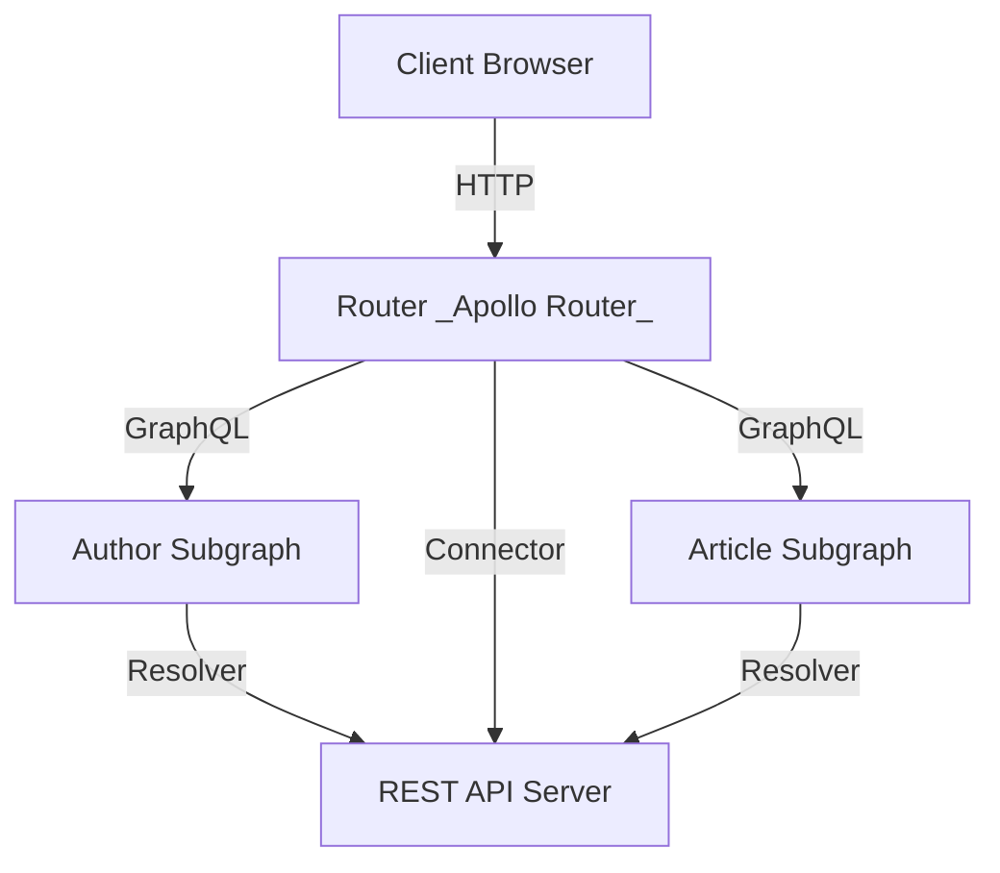

# REST Subscription Example

## Pre-requisites

- [Node.js](https://nodejs.org/)
- [pnpm](https://pnpm.io/)

## Setup

```sh
./prepare.sh
pnpm dev
```

## Manual Setup

0. Install node (>=22) and pnpm (>=10)
1. `pnpm i`
2. cd inside each folder and run `pnpm i`
3. in `rest-api` copy the example.env to .env
4. `pnpm dev`

## Usage

Visit [http://localhost:4000](http://localhost:4000) to access the Apollo Server.

---

## Architecture



- **REST API Server**: Provides REST endpoints for data access.
- **Author Subgraph**: GraphQL subgraph exposing author-related data.
- **Article Subgraph**: GraphQL subgraph exposing article-related data.
- **Router**: Apollo Router federates subgraphs and proxies REST calls, exposing a unified GraphQL API.
